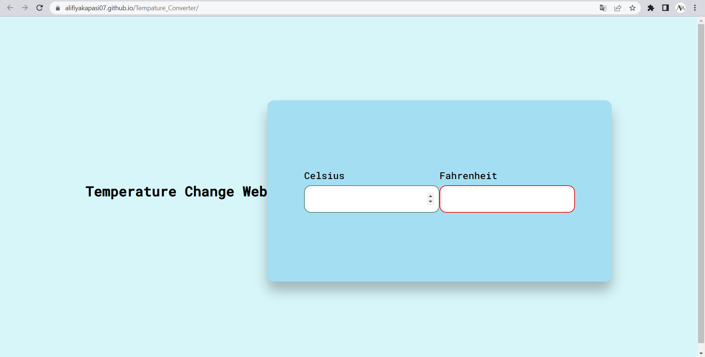

# OASIS-TASK-3_LEVEL-1
# Temperature Converter
This is the temperature converter web which i created for internship for Oasis Infobyte.

# Landing_Page
> https://alifiyakapasi07.github.io/Tempature_Converter/

## Website Preview
#### Landing Page

  

## Features 📋
⚡️ Fully Responsive
⚡️ Easy to modify

## Sections 📚
✔️ Celsius\
✔️ Fahrenheit\

## Tools Used 🛠️
* <b>GitHub Pages</b> - To host my static website (HTML, CSS, JS).

